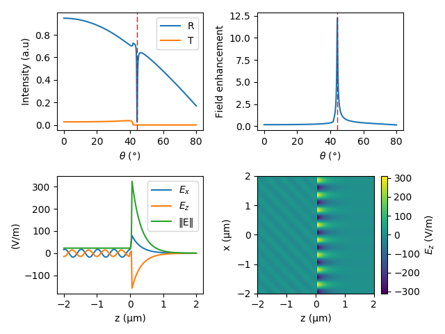

.. py:currentmodule:: NonlinearTMM

Getting started
###############

Installation
************

Installation of NonlinearTMM package is possible through pip or from source
code.

Requirements:

* `Python >3.0 <https://www.python.org/>`_
* C++ compiler
* `Cython <http://cython.org/>`_
* `Numpy <http://www.numpy.org/>`_
* `Eigency <https://github.com/wouterboomsma/eigency>`_

Dependencies:

* C++ code depends on `Eigen library <http://eigen.tuxfamily.org/>`_ (already included in package) 

Installation through pip is done like:

.. code-block:: bash

	pip install NonlinearTMM

Alternatively, it is possible to install the package form the source code by commands

.. code-block:: bash

	python setup.py install

or

.. code-block:: bash

	pip intall .
	
in the source code folder.

Package structure
*****************

The package has three main classes:

* :class:`Material`
* :class:`TMM`
* :class:`SecondOrderNLTMM`

Class :class:`Material` is responsible to represent the properties of optical
material. Mainly wavelength dependent refractive indices and second-order
suceptibility tensor for nonlinear processes.

Class :class:`TMM` (alias of :class:`NonlinearTMM`) is has all the standard TMM features:

* Both p- and s-polarization
* Arbritarty angle of incidence
* Calculation of reflection, transmission and absorption of plane waves (:any:`GetIntensities <NonlinearTMM.GetIntensities>` and :any:`GetAbsorbedIntensity <NonlinearTMM.GetAbsorbedIntensity>`)
* Calculaion of electric and magnetic fields inside structure (:any:`GetFields <NonlinearTMM.GetFields>` and :any:`GetFields2D <NonlinearTMM.GetFields2D>`)
* Calculation of field enhancement (:any:`GetEnhancement <NonlinearTMM.GetEnhancement>`)
* Sweep over any parameter (:any:`Sweep <NonlinearTMM.Sweep>`)

In addition to those standard features, the class has similar functionality to
work with waves with arbritarty profile (e.g. Gaussian beam). The configuration
of the beam is done through attribute :any:`wave <NonlinearTMM.wave>` (see class :any:`_Wave`).
The interface for the calculations with arbritarty beams is similar to standard TMM:

* Calculation of reflection, transmission and absorption of beams (:any:`WaveGetPowerFlows <NonlinearTMM.WaveGetPowerFlows>`)
* Calculaion of electric and magnetic fields inside structure (:any:`WaveGetFields2D <NonlinearTMM.WaveGetFields2D>`)
* Calculation of field enhancement (:any:`WaveGetEnhancement <NonlinearTMM.WaveGetEnhancement>`)
* Sweep over any parameter (:any:`WaveSweep <NonlinearTMM.WaveSweep>`)

Finally, :class:`SecondOrderNLTMM` class ic capable of calculating second-order
nonlinear processes like second-harmonic generation, sum-frequency generation and
difference frequency generation. This has similar interface as :any:`TMM` - it
supports both the plane waves and beams. 

Standard TMM
************

.. literalinclude:: ../Examples/ExampleTMM.py

